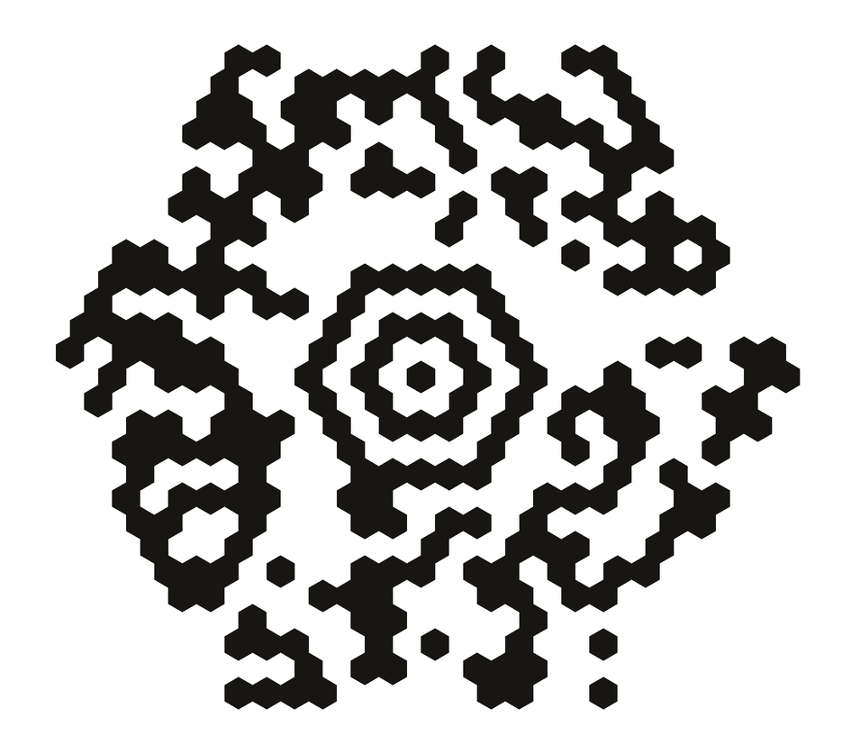
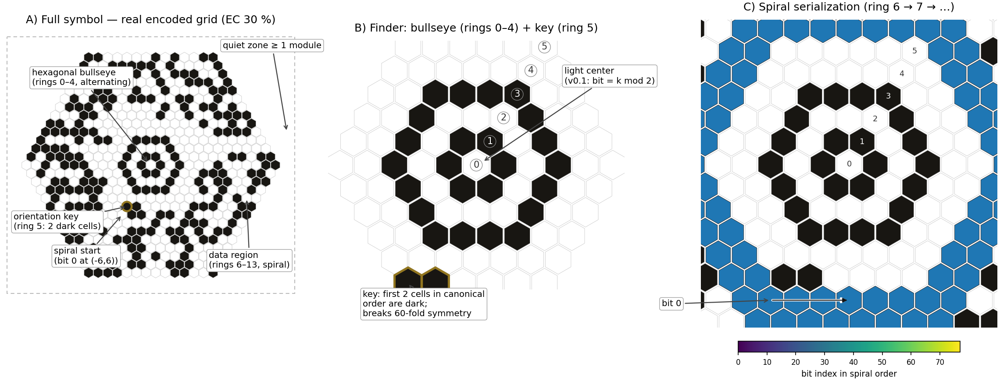

# Hexatess Code 🐝
[](https://pypi.org/project/hexatess-code/) 

[](https://pypi.org/project/hexatess-code/) 

[](https://github.com/lovro-abram/hexatess-code/actions/workflows/ci.yml) 

**An experimental 2D barcode on a hexagonal grid** — with a hexagonal
bullseye finder, spiral serialization and a continuously selectable
Reed-Solomon error-correction budget of 5–90 %.



```python
from hexatess import encode, decode, render

grid, params = encode("Hello, Hexatess!", ec_pct=30)
render(grid, "hello.png")
text, stats = decode(grid)          # ('Hello, Hexatess!', {...})
```

## Symbol anatomy



* **A** — a real encoded symbol: hexagonal bullseye finder (rings 0–4),
  orientation key (ring 5: two dark cells), data region (rings 6…)
  filled in spiral order, and a quiet zone of at least 1 module;
* **B** — finder close-up: dark centre (rule `bit = 1 − ring mod 2`),
  alternating dark/light rings, and the key — the first two canonical
  ring-5 cells set dark, breaking the 60-fold symmetry and marking the
  spiral start direction;
* **C** — spiral bit order across rings 6–7 (bit 0 at cell `(−6, +6)`),
  rendered from the actual reference encoder output.

## Why hexagons?

* **+15.5 % packing density** over the square grid — hexagons tile the
  plane with ~15.5 % more modules per area at equal module size, which
  directly translates into more data per printed area.
* **Rotational isotropy** — three axes of symmetry instead of two;
  damage from any direction is statistically equivalent.
* **Proven heritage** — MaxiCode (UPS, ISO/IEC 16023) already proved a
  hexagonal 2D code works in the field; Hexatess Code generalizes the
  idea to variable-size, high-capacity, Aztec-style symbols.
* **Modern error control** — continuous EC budget from 5 % to 90 %
  (not 7 discrete levels), independent RS blocks of ≤ 50 data bytes,
  and a double-protected header.

> **Status: experimental.** This is a young format: the symbol
> specification and reference implementation are solid and heavily
> tested (2,500+ tests, conformance vectors).  A **camera decoder**
> (`hexatess.camera`, optional `[camera]` extra) already reads symbols
> from real photographs in about a second — printed labels, foil
> transparencies, tilted and rotated shots.  Since spec v0.3 payload
> text is zlib-compressed automatically, so long texts fit into
> considerably smaller symbols.  See the roadmap below.  Adopting a
> young format is a deliberate bet; the [full format
> specification](SPECIFICATION.md) is the insurance.

## Installation

```bash
pip install hexatess-code            # from PyPI (once published)
pip install "hexatess-code[camera]"  # + photo decoding (numpy, opencv, scipy)
# or from a source checkout:
pip install -e .
```

Requires Python ≥ 3.8; Pillow for rendering, numpy + OpenCV + SciPy
for the optional camera decoder.

## Command line

```bash
hexatess "Hello world" -o koda.png --ec 30
hexatess "Important URL https://example.org" -o url.png --ec 55
hexatess --demo                       # demo symbol + robustness statistics
hexatess decode-photo photo1.jpg photo2.jpg   # read symbols from photos
```

Payload text is zlib-compressed automatically when that saves space
(`--no-compress` disables it; the header flag keeps decoders fully
backward compatible).

## Payload compression (spec v0.3)

One header bit marks the payload as a zlib stream. The encoder applies
it only when it strictly helps, and decoders inflate transparently —
symbols without the flag are byte-identical to v0.2. What that means
in practice (EC 30 unless noted):

| payload | raw | stored | symbol |
|---|---|---|---|
| 80 digits | 80 B | 21 B | rmax 17 → 11 |
| `"X" × 250` | 250 B | 12 B | rmax 30 → 10 |
| 849-byte Slovene paragraph | 849 B | 203 B | would not fit → rmax 28 |
| short strings (≤ ~30 B) | — | unchanged | overhead wins |

The maximum *stored* capacity is unchanged (329 bytes at EC 5), so
incompressible data behaves exactly as before.

## API

| Function | Description |
|---|---|
| `encode(text, ec_pct=30, mask_id="auto", min_rings=None, compress="auto")` | UTF-8 text → `(grid, params)`; `grid` maps axial `(q, r)` to `0/1` |
| `decode(grid)` | grid → `(text, stats)`; RS-corrects and inflates transparently |
| `render(grid, path, size_px=18, ...)` | grid → PNG (pointy-top hexagons, quiet zone, supersampling) |
| `sample_grid_from_image(path, rmax, ...)` | ideal re-sampling of a rendered PNG (self-test helper) |
| `run_tests(...)` | noise/blob robustness statistics |
| `hexatess.camera.decode_photo(path)` | photograph → `(text, stats)`; finder detection, perspective handling, adaptive sampling (optional `[camera]` extra) |

`params` / `stats` contain `rmax` (radius in rings), `mask`, `ec`,
`blocks` (list of `(data_bytes, ecc_bytes)`), `data_len` (stored
length) and `compressed`; `stats` also reports `repair_bits` (the RS
correction ledger) and, for camera decodes, `sector` and
`finder_hits`.

## Error-correction budget

Choose any multiple of 5 between 5 and 90:

| EC | Character |
|---|---|
| 5–15 | maximum capacity, clean environments |
| 25–40 | general use (default 30) |
| 50–70 | industrial / outdoor |
| 80–90 | extreme damage tolerance |

Physical behaviour (measured on the reference implementation): one
flipped module is one RS *symbol* error, so uniform-noise tolerance is
roughly `EC / 16` percent of modules, while clustered (smudge/blob)
damage survives several times higher area fractions because flips
concentrate inside whole bytes.

## Implement it in your own language

A **pure-JavaScript encoder** already ships in this repository — see
[`javascript/`](javascript/) (zero dependencies, byte-identical to the
Python reference for uncompressed symbols, includes a browser demo).

The format is deliberately **specification-first**: everything needed
for an independent implementation is in
[`SPECIFICATION.md`](SPECIFICATION.md), and
[`test_vectors/vectors_v0.3.json`](test_vectors/vectors_v0.3.json)
contains fixed inputs/outputs (grids, headers, damaged symbols, expected
results) to verify conformance. If your Rust/Go/JS decoder passes the
vectors, it speaks Hexatess Code.

## Roadmap

1. ~~v0.2/0.3 — camera decoding~~ **done (v0.3.0):** `hexatess.camera`
   reads symbols from photographs — bullseye detection, homography +
   correction-field warp handling, adaptive sampling; validated on
   printed foil with curl and glare.  **v0.3.1:** ≈10× faster
   (a typical 12 MP photo now takes about a second) plus stable
   outer-ring sampling and mis-decode-proof pose selection.
2. ~~v0.3 — payload compression~~ **done (v0.3.1):** zlib flag bit in
   the header, applied automatically when it helps.
3. **Erasure decoding:** declare blob-occluded modules as
   erasures → doubles correctable symbol counts.
4. **JavaScript/TypeScript SDK** + online playground (generate a code
   in the browser in 10 seconds) — **encoder done:**
   [`javascript/`](javascript/); decoder + hosted playground next.
5. Larger radii / capacity beyond 329 stored bytes (breaking header
   change).

Contributions welcome — see [CONTRIBUTING.md](CONTRIBUTING.md).

## License

* Code: [MIT](LICENSE)
* Specification: CC-BY-4.0 — implement it anywhere, commercially, under
  any license, no royalties, forever.

---

*Hexatess Code stands on the shoulders of giants: Aztec Code (bullseye +
spiral), MaxiCode (hexagonal lattice), QR Code and Data Matrix
(Reed-Solomon practice).*
