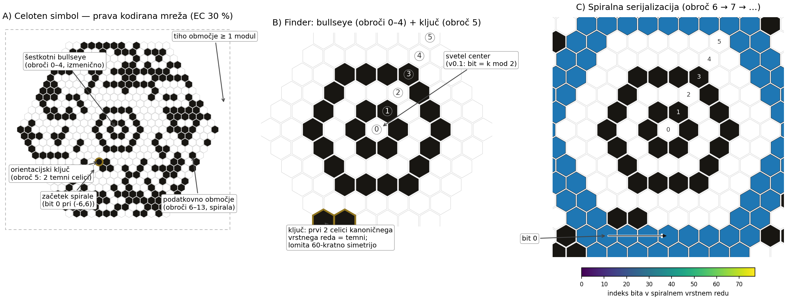

# Hexatess Koda 🐝 (slovenska verzija)

**Eksperimentalna 2D koda na šestkotni mreži** — s šestkotnim
bullseye najditeljem, spiralno serijalizacijo in prosto izbiro
Reed-Solomon popravek napak od 5 % do 90 %.


```python
from hexatess import encode, decode, render

grid, params = encode("Živjo, Hexatess!", ec_pct=30)
render(grid, "zivjo.png")
besedilo, stat = decode(grid)       # ('Živjo, Hexatess!', {...})
```

## Anatomija simbola



* **A** — prava kodirana koda: šestkotni bullseye najditelj (obroči
  0–4), orientacijski ključ (obroč 5: dve temni celici), podatkovno
  območje (obroči 6 …) v spiralnem vrstnem redu in tiho območje
  vsaj 1 modul;
* **B** — bližnjica finderja: svetel center (pravilo v0.1:
  `bit = obroč mod 2`), izmenično temni/svetli obroči in ključ — prvi
  dve celici kanoničnega vrstnega reda obroča 5 sta temni, kar lomi
  60-kratno simetrijo in označuje smer začetka spirale;
* **C** — spiralni vrstni red bitov čez obroča 6–7 (bit 0 na celici
  `(−6, +6)`), izrisan neposredno iz izhoda referenčnega kodirnika.

## Zakaj šestkotniki?

* **+15,5 % gostote pakiranja** glede na kvadratno mrežo — šestkotniki
  zapolnijo površino s ~15,5 % več moduli pri enaki velikosti modula,
  kar neposredno pomeni več podatkov na enaki površini.
* **Rotacijska izotropija** — tri osi simetrije namesto dveh; poškodbe
  s katere koli smeri so statistično enakovredne.
* **Preverjena dediščina** — MaxiCode (UPS, ISO/IEC 16023) je že
  dokazal, da šestkotna 2D koda deluje v praksi; Hexatess Koda idejo
  posploši na spremenljivo velike, visokokapacitetne simbole v duhu
  Aztec Code.
* **Sodobno ravnanje z napakami** — zvezni proračun EC od 5 % do 90 %
  (ne 7 diskretnih ravni), neodvisni RS bloki do 50 podatkovnih bajtov
  in dvojno zaščitena glava.

> **Stanje: eksperimentalno.** Format je mlad: specifikacija simbola in
> referenčna implementacija sta trdni in temeljito preizkušeni (2.500+
> testov, konformnostni vektorji), a **kamera-dekodirnik še ne obstaja**
> — branje slik za zdaj privzame idealno, pokončno vzorčenje. Glej
> načrt spodaj. Posvojitev mladega formata je premišljena stav;
> [polna specifikacija formata](SPECIFICATION.md) je zavarovanje.

## Namestitev

```bash
pip install hexatess-code            # iz PyPI (ko bo objavljeno)
# ali iz izvorne kode:
pip install -e .
```

Zahteva Python ≥ 3.8 in Pillow (samo za izris).

## Ukazna vrstica

```bash
hexatess "Živijo svet" -o koda.png --ec 30
hexatess-code --demo        # demo simbol + statistika odpornosti
```

## API

| Funkcija | Opis |
|---|---|
| `encode(besedilo, ec_pct=30, mask_id="auto", min_rings=None)` | UTF-8 besedilo → `(mreza, parametri)`; mreža preslika aksialne `(q, r)` v `0/1` |
| `decode(mreza)` | mreža → `(besedilo, statistika)`; RS popravek je prozoren |
| `render(mreza, pot, size_px=18, ...)` | mreža → PNG (pointy-top šestkotniki, tiho območje, supersampling) |
| `sample_grid_from_image(pot, rmax, ...)` | idealno vzorčenje izrisanega PNG (pomožnik za samoteste) |
| `run_tests(...)` | statistika odpornosti na šum in lake |

`parametri` / `statistika` vsebujeta `rmax` (radij v obročih), `mask`,
`ec`, `blocks` (seznam `(podatkovni_bajti, ecc_bajti)`) in `data_len`.

## Proračun za popravo napak

Izbirajte poljuben večkratnik 5 med 5 in 90:

| EC | Značaj |
|---|---|
| 5–15 | največja kapaciteta, čista okolja |
| 25–40 | splošna uporaba (privzeto 30) |
| 50–70 | industrija / zunanjost |
| 80–90 | skrajna tolerantnost na poškodbe |

Fizično obnašanje (izmerjeno na referenčni implementaciji): en obrnjen
modul je ena *simbolna* napaka RS, zato je tolerantnost na enakomeren
šum približno `EC / 16` % modulov, skupinska poškodba (madež, laka) pa
preživi večkrat večji delež površine, ker se obrati zbirajo znotraj
celih bajtov.

## Implementirajte jo v svojem jeziku

Format je namenoma **specifikacija-na-prvem-mestu**: vse, kar potrebujete
za neodvisno implementacijo, je v [`SPECIFICATION.md`](SPECIFICATION.md),
datoteka
[`test_vectors/vectors_v0.1.json`](test_vectors/vectors_v0.1.json)
pa vsebuje fiksne vhode/izhode (mreže, glave, poškodovane simbole,
pričakovane rezultate) za preverjanje skladnosti. Če vaš dekodirnik v
Rust/Go/JS prenese vektorje, govori Hexatess.

## Načrt

1. **v0.2 — dekodiranje s kamero:** zaznavanje bullseye + korekcija
   perspektive (ključni korak za ekosistem).
2. **v0.2 — dekodiranje z izbrisi:** moduli pod madežem se razglasijo
   za izbrise → podvojena zmogljivost popravka.
3. **JavaScript/TypeScript SDK** + spletni playground (koda v brskalniku
   v 10 sekundah).
4. Večji radiji / kapaciteta nad 329 bajti (nezdružljiva sprememba glave).

Prispevki so dobrodošli — glej [CONTRIBUTING.md](CONTRIBUTING.md).

## Licenca

* Koda: [MIT](LICENSE)
* Specifikacija: CC-BY-4.0 — implementirajte kjerkoli, komercialno, pod
  katero koli licenco, brez avtorskih pravic, za vedno.

---

*Hexatess Koda stoji na ramih velikanov: Aztec Code (bullseye + spirala),
MaxiCode (šestkotna mreža), QR Code in Data Matrix (Reed-Solomon
praksa).*
